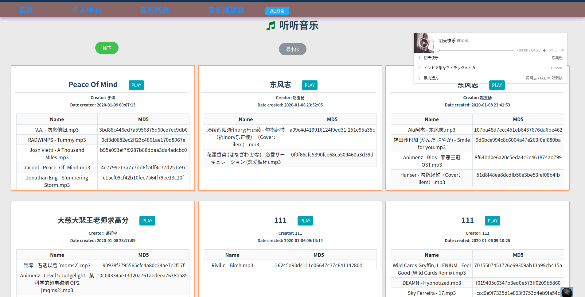
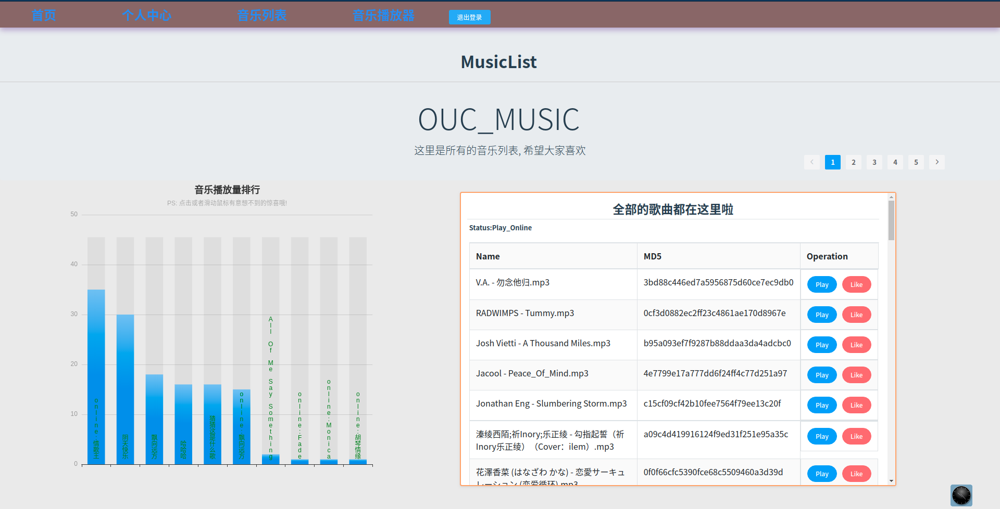
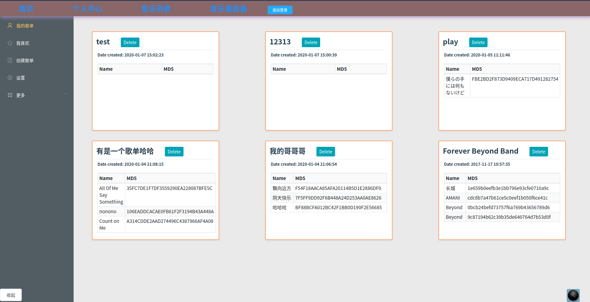
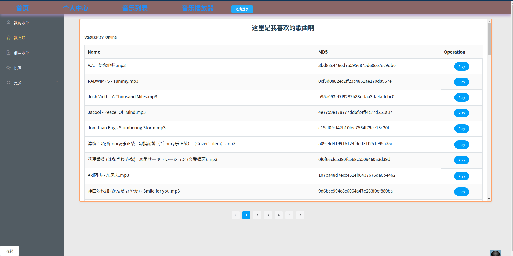
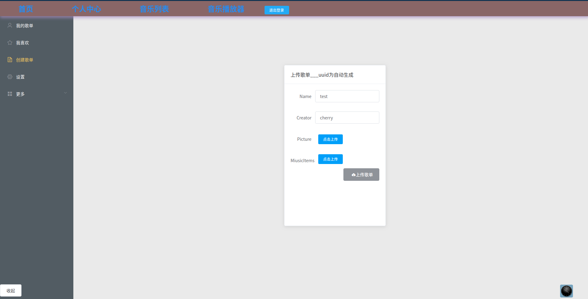
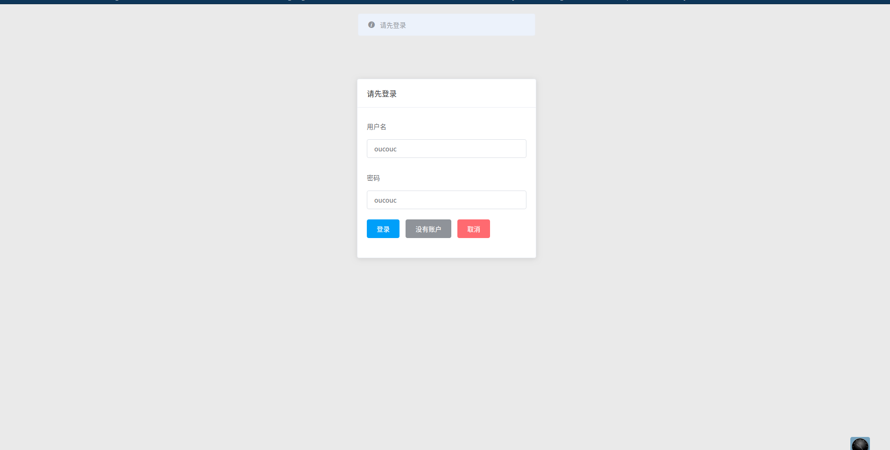
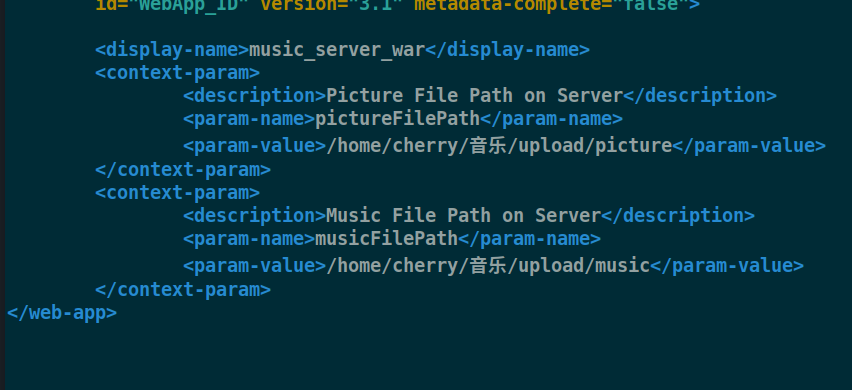
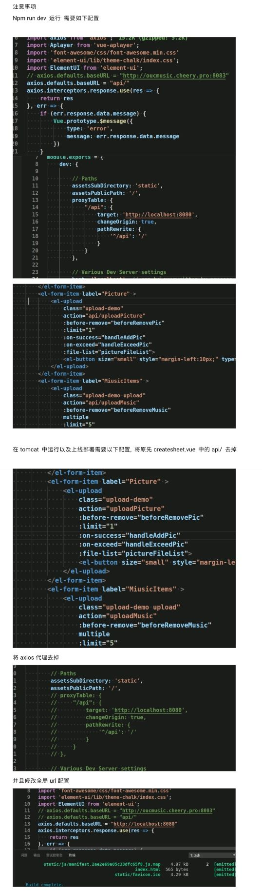

# JAVA 音乐播放器
项目已经上线部署可以直接点击预览 , 链接: http://oucmusic.cheery.pro:8083/#/index

## 文件夹分别是: 前端, 后端(已经将编译好的前端放入可以直接运行), 说明文档

> `小注意事项`

注意为了获得更好的体验如果笔记本或者浏览器开启了缩放`请修改回 100% 的缩放`
## 项目预览






## 前端
> VUE+VUErouter+Axios+ElementUI+VUEPlayer+WebPack
### Build Setup
#### 使用方式如下
``` bash
# install dependencies
npm install

# serve with hot reload at localhost:8080
npm run dev

# build for production with minification
npm run build

# build for production and view the bundle analyzer report
npm run build --report
```

`注意代理设置与全局默认url的设置`
## 后端
JAVA + Servlet + RESTFUl_API 
默认端口8080可以直接运行
1. 需要导入文件夹下面的数据库, 并设置数据库名字和密码
2. 注意一下这个这里的路径是上传的路径, 修改你想上传的路径不然找不到


3. 开始运行

#### 其他注意事项: 

